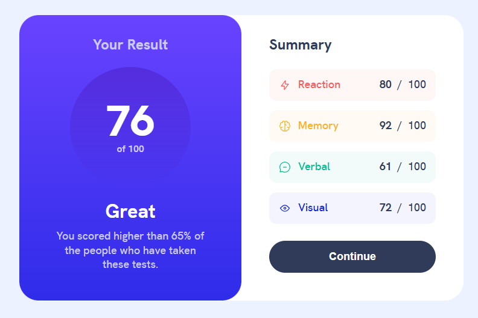
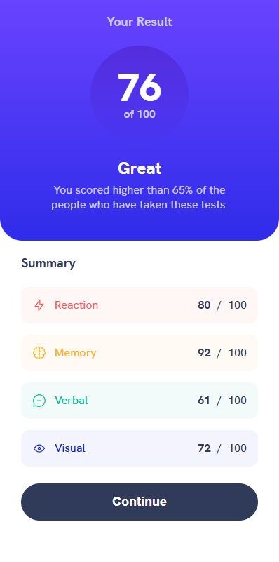

# Frontend Mentor - Results summary component solution

This is a solution to the [Results summary component challenge on Frontend Mentor](https://www.frontendmentor.io/challenges/results-summary-component-CE_K6s0maV). Frontend Mentor challenges help you improve your coding skills by building realistic projects.

## Table of contents

- [Overview](#overview)
  - [The challenge](#the-challenge)
  - [Screenshot](#screenshot)
  - [Links](#links)
- [My process](#my-process)
  - [Built with](#built-with)
  - [What I learned](#what-i-learned)
  - [Continued development](#continued-development)
  - [Useful resources](#useful-resources)
- [Author](#author)

## Overview

### The challenge

Users should be able to:

- View the optimal layout for the interface depending on their device's screen size
- See hover and focus states for all interactive elements on the page
- **Bonus**: Use the local JSON data to dynamically populate the content

### Screenshot

### Links

- Solution URL: [Githup repo](https://github.com/morauszkia/fm-results-summary-svelte)
- Live Site URL: [Github Pages](https://morauszkia.github.io/fm-results-summary-svelte/)

## My process

### Built with

- Semantic HTML5 markup
- CSS custom properties
- Flexbox
- Mobile-first workflow
- [Svelte](https://svelte.dev/) - JS framework
- [Vite](https://vite.dev) - Build Tool

### What I learned

After I finished this challenge using Vue.js (for the result see [this page](https://github.com/morauszkia/fm-results-summary-component) and [repo](https://morauszkia.github.io/fm-results-summary-component/)), I wanted to build it with Svelte, too. So, this is it. It was great to revisit Svelte after a long time. In the meantime Svelte evolved with adopting the runes, so there was some new stuff to learn. (There always is with web development, isn't there?) But I still like Svelte, like its simplicity and built in reactivity and basically everything. DX was really great. I hope to see Svelte gaining popularity in the future.

### Continued development

In the future I want to use Svelte more often to build more complex applications. Probably I won't revisit this challenge, but who knows.

### Useful resources

- [Svelte docs](https://svelte.dev/docs/svelte/overview)
- [Vite docs](https://vite.dev/guide/assets.html) - These helped me a lot, especially with static asset handling and deployment.

## Author

- Frontend Mentor - [@mantis](https://www.frontendmentor.io/profile/morauszkia)
- X - [@mantis_hu86](https://x.com/mantis_hu86)
- Github -[@mantis](https://github.com/morauszkia)
- LinkedIn - [András Morauszki](https://www.linkedin.com/in/andras-morauszki/)
